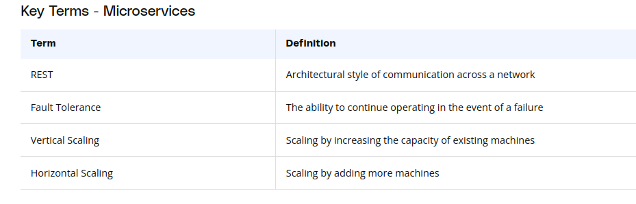
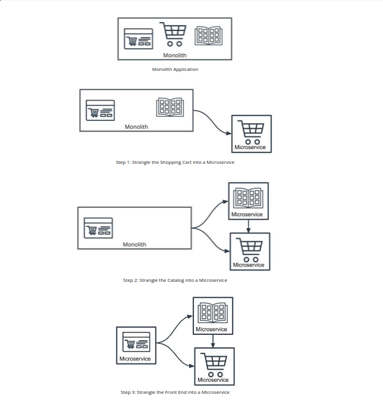
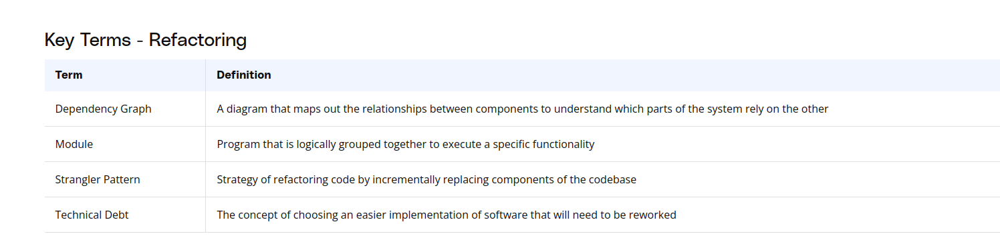
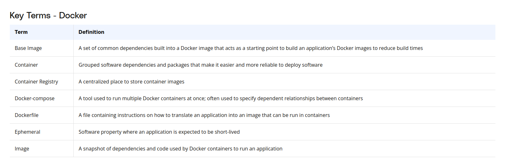
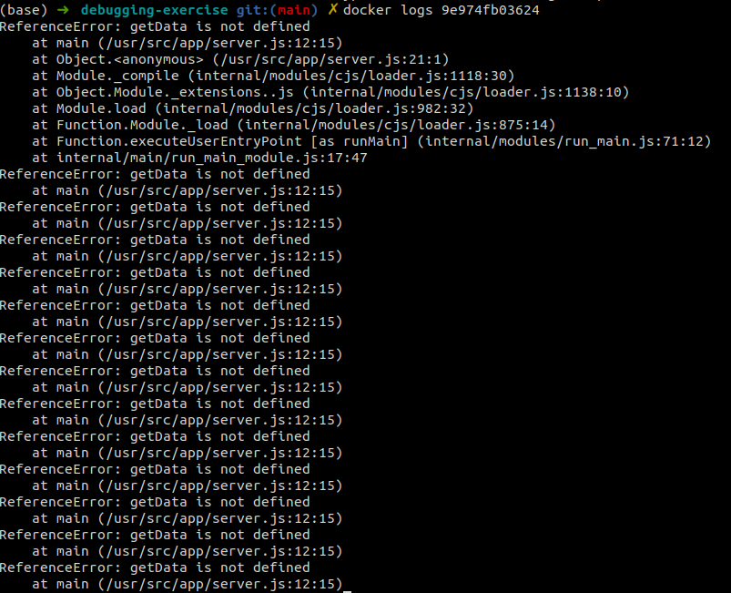
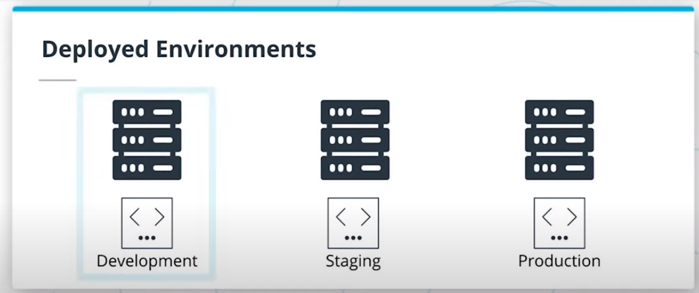

# 3-Monolith-Microservices-Scale
1. [Introduction to Microservices](#schema1)
2. [When Not to Use Microservices](#schema2)
3. [Course Outline](#schema3)
4. [AWS - Install and Configure CLI](#schema4)
5. [Monolith vs. Microservices](#schema5)
6. [Microservice Architecture Designs](#schema6)
7. [Divide Into Microservices](#schema7)
8. [Containers Using Docker](#schema8)
9. [Introducing Containers](#schema9)
10. [Docker](#schema10)
11. [Debug a Container](#schema11)
12. [Exercise: Debugging](#schema12)
13. [Container Registries](#schema13)
14. [Modifying Containers](#schema14)
15. [Automating the Application Development Lifecycle - Why Use Deployment Pipelines?](#schema15)
16. [CI/CD Benefits](#schema16)
17. [Using Travis CI](#schema17)

<hr>
<a name='schema1'></a>

## 1. Introduction to Microservices


**Monolitos:**

- Un monolito es una aplicación de software que se desarrolla como una única unidad o componente. Todas las funciones y características de la aplicación están empaquetadas y desplegadas juntas.
- En un monolito, todas las partes de la aplicación, como la interfaz de usuario, la lógica empresarial y la capa de datos, están interconectadas y suelen ser dependientes entre sí.
- Los monolitos son relativamente simples de desarrollar y desplegar, ya que toda la aplicación se compila y despliega como una sola entidad.
- Sin embargo, a medida que la aplicación crece en tamaño y complejidad, los monolitos pueden volverse difíciles de mantener y escalar. Además, un fallo en una parte de la aplicación puede afectar a todo el sistema.

**Microservicios:**

- Los microservicios son una arquitectura en la que una aplicación se descompone en componentes más pequeños e independientes, llamados microservicios. Cada microservicio se enfoca en una tarea específica o función de negocio.
- Los microservicios están diseñados para ser altamente cohesionados y débilmente acoplados. Esto significa que cada microservicio puede ser desarrollado, desplegado, y escalado de forma independiente sin afectar a otros componentes del sistema.
- Los microservicios se comunican entre sí a través de protocolos ligeros, como HTTP o mensajes asincrónicos. Pueden estar implementados con diferentes tecnologías y lenguajes de programación según lo que sea más adecuado para cada servicio.
- La arquitectura de microservicios facilita la escalabilidad y la flexibilidad, ya que permite a los equipos de desarrollo trabajar de forma independiente en diferentes partes de la aplicación. Sin embargo, también puede introducir complejidad en la gestión de la comunicación entre los servicios y la coordinación de las operaciones.


<hr>
<a name='schema2'></a>

## 2. When Not to Use Microservices

**Monoliths Are Not Bad!**
Microservices designs are another architectural pattern and are not intended to replace monolith applications. We should not blindly build applications as microservices without understanding the tradeoffs. Doing so could actually decrease productivity!

One way to think about this is to revisit our analogy with the Sports Superstore. Does it make sense for every aspiring small business owner to open and manage multiple stores at once?

**Considerations for Not Using Microservices**
- **System Complexity**
Rather than deploying a single application, we would be deploying multiple modules separately. There is more overhead in setting up projects.

- **Network Latency**
By introducing a network between modules, we have increased latency in application performance and will find it harder to debug our application.

- **Difficulty with Debugging**
We can no longer rely on a stack trace or tools that can help us pinpoint where a bug is. We may end up relying on logging to find causes of issues.


<hr>
<a name='schema3'></a>

## 3. Course Outline

**Microservices Design Principles and Best Practices**
- Explain different microservices architecture designs
- Divide an application into microservices

**Containers using `Docker`**
- Build and run a container image using Docker
Debug a container
- Store these images using a container registry

**Independent Releases and Deployments**
- Understand `CI/CD` benefits
- Use `Travis` to build a `CI/CD` pipeline
- Integrate `GitHub` and `CI/CD` and automate testing with CI
- Understand alternatives to `Travis` `CI` including `Jenkins`

**Service Orchestration with `Kubernetes`**
- Understand the fundamentals of `Kubernetes`

- Configure and launch an auto-scaling, self-healing `Kubernetes cluster`

- Deploy microservices using a `Kubernetes cluster`

- Understand alternative deployment strategies including `ECS` and `Fargate`

**Securing and Tuning Kubernetes Services for Production**
- Use a reverse proxy to direct requests to the appropriate backend
- Securing the microservices
- Configure scaling and self-healing for each service
- Understand the differences between internal and external traffic

**Debugging, Monitoring, and Logging** 
- Use best practices for logging with microservices
- Use logs to capture metrics for debugging
-  Implement monitoring and logging for microservices deployment
- Improve resilience and availability into cloud applications

<hr>
<a name='schema4'></a>


## 4. AWS - Install and Configure CLI

https://github.com/Cloud-developer-aws/2-Full-Stack-Apps-on-AWS


<hr>
<a name='schema5'></a>

## 5. Monolith vs. Microservices

- Microservices are an architectural style where an application is composed of modules that can be independently developed and deployed.
- In monoliths, all the components of the application are built into a single application.

**Microservice Benefits**
- Scale Lean applications that are able to tailor their logic and infrastructure to their specific business needs. More-easily architected for horizontally scaling.
- Development in Parallel Teams can develop and deploy their own codebases.
- Cost-Effectiveness Utilize resources only for what is necessary for the specific microservice.
- Flexibility Choose technologies that make the most sense for the team and business.


<hr>
<a name='schema6'></a>

## 6. Microservice Architecture Designs

**Properties of Microservices**

- **Communication**
  - Services communicate through a network
  - REST is currently the most-commonly used network interface

- **Independently Deployed**
  - Deployment to one service should not affect another

- **Fault tolerant**
  - Diligence in writing code that can anticipate when another microservice isn’t working




<hr>
<a name='schema7'></a>

## 7. Divide Into Microservices

Divide a Monolith Application Into Microservices

**Map Your Dependencies**
- It's important to understand the application you're working with before breaking it apart.
- One strategy is to map out the modules and their dependencies as a directed graph to understand the downstream impact of your changes.


**Where to Start?**
- There’s no hard rule: choose the part of the application that makes the most sense to you.
- Dependency graph serves merely as a guideline on risk based on the number of dependencies.
- A module with the least dependencies will potentially have the downstream effects meaning less risk.


**How to Start?**
- The Strangler pattern is a common and effective way to migrate legacy applications.
- Rather than replacing your code with a new version, you can gradually replace components of your application.

**Shared Code**
- Code duplication can be abstracted into common libraries used across projects.







<hr>
<a name='schema8'></a>

## 8. Containers Using Docker

**Why Use Containers?**

**Your Code is Not a Black Box...Yet**
- Applications often require many packages and dependencies to run properly
- It’s common for an application to work on one computer but not another

**Deployment Headaches**
- Organizations often have different development environments. These often include development and production.
- Deploying and testing the same code across different environments can be cumbersome
- In practice, it’s difficult to keep a development and production environment perfectly synchronized with regards to their versions, operating systems, dependencies, etc.
- It is common for code to work in a development environment and not behave as expected in production


<hr>
<a name='schema9'></a>

## 9. Introducing Containers

**Your Code is Now Kind of a Black Box**
- Containers are self-contained applications with all the dependencies needed to run
- Containers can be treated as one unit of deployment
- Rolling back code with containers is simply re-deploying an older snapshot


**Why Kind of?**
- Containers make things easier but don’t magically make deployment problems disappear
- Code may still work in one environment and fail in another, though now we have an understanding of what might have failed

**Containers are Ephemeral**
- Containers should be stateless and are expected to be destroyed.

**Containers Help Manage Dependencies**
- Each container can be running its own versioned software. We resolve the issue where different applications may have different dependencies.


**Simplify Deployment**
- Containers are self-contained so deployment is simply swapping out an existing container with a new one.


<hr>
<a name='schema10'></a>

## 10. Docker

**Docker Image**

When we have an application that we want to deploy, we can package it into a Docker Image. The image contains all of your code and dependencies.

**Docker Container**

A Docker Container is an ephemeral running instance of a Docker Image.

**Dockerfile**

A Dockerfile defines the steps to create a Docker Image.


**Basic Commands:**

`docker build .`  will run the Dockerfile to create an image

`docker images` will print all the available images

`docker run {IMAGE_ID}` will run a container with the image

`docker ps` will print all the running containers

`docker kill {CONTAINER_ID}` will terminate the container




<hr>
<a name='schema11'></a>

## 11. Debug a Container

- Viewing Logs
  - `docker logs {CONTAINER ID}`
- Attaching to a Container
  - `docker exec -it sh`
- View Docker Processes
  - `docker ps`
- View Details of Docker Objects
  - `docker inspect`

https://docs.docker.com/engine/reference/commandline/container_logs/


**Why might a container work in a local environment but not in a deployed environment?**
- Docker is programming language agnostic so it doesn't matter which programming language you use
- Security restrictions can cause problems because we often have to interface with other resources and the permission we use locally, may be different than in the deployed environment
- System resouces are also important to ensure we have all of the resources that an application needs to run
- Credentials can also be problematic as you deploy code from a local environment to a deployed environment


<hr>
<a name='schema12'></a>

## 12. Exercise: Debugging

Folder debugging-exercise


- Build the Docker image:
``` bash
docker build -t debug_me .
```
- Check that the image has been build and access its IMAGE ID
```bash
docker images
```
- Run Docker container
```bash
docker run -d {IMAGE ID}
```
Using the -d flag runs the image in a container as a background task so the container we can continue to run other commands in our terminal.

- View Docker Processes
```bash
  docker ps
```
- View Details of Docker Objects
```bash
docker inspect {CONTAINER ID}
```

- Viewing Logs
``` bash
docker logs {CONTAINER ID}
```



- Inspect the code in `server.js` and see that there is a typo -- should be getDate instead of getData

- Fix the error, rebuild the Docker image and re-run it to confirm that the error has resolved.
```bash

docker build -t debug_me .  
```
```bash
docker images 
```
```bash
docker run -d  ID_image
```
```bash
docker logs container_id
```
- Stop all containers
```bash
docker stop $(docker ps -q)

```
- Delete all containers
```bash
docker rm $(docker ps -aq)

```

- Delete image
```bash
docker rmi  ID_image
```


<hr>
<a name='schema13'></a>


## 13. Container Registries

**Container Registries**
- A container registry serves as a centralized place to store and version images.
- [DockerHub](https://hub.docker.com/) is a popular container registry run by the same organization that created Docker.

**Creating and Using a DockerHub Repository**
1. In DockerHub, create a new repository and set it to Public

2. In your terminal, login to DockerHub

```bash
docker login --username={YOUR USERNAME}
```

3. Tag your local image with the repository name:
```bash
docker tag {LOCAL IMAGE NAME} {USERNAME}/{REPOSITORY NAME}
```
4. Push the image to DockerHub
```bash
docker push {TAGGED IMAGE}
```


**Base Images**
- Bundles the steps that are repeated in multiple builds into a pre-built package
- Base images reduce time that it takes to run redundant operations
- Uses the FROM keyword in Dockerfile, e.g. FROM node:13


<hr>
<a name='schema14'></a>

## 14. Modifying Containers

**Best Practices for Modifying Containers**
- Docker images should be considered a single unit of deployment.
- You shouldn't be editing code or making changes to the system at all in a container.
- If something is broken, you build a new image and deploy that to a new container.

```bash
docker exec -it {Id_container} sh

```
Se utiliza para iniciar una sesión interactiva dentro de un contenedor Docker en ejecución y ejecutar el shell Bash (sh) dentro de ese contenedor. Esto es útil para realizar tareas de mantenimiento, depuración o exploración dentro del entorno del contenedor.
Se pue usar por ejemplo `ls` para ver el listado de archivos de la carpeta

- Modified error
```bash
vim server.js 
```
- Rebuilt image
```bash

docker build -t debug_me .  
```


<hr>
<a name='schema15'></a>


## 15. Automating the Application Development Lifecycle - Why Use Deployment Pipelines?

### **Understanding Deployment Pipelines**
- We now have industry standards and tools for how we can deploy our code.
- Docker containers simplify what we deploy.
- Deployment pipelines simplify how we deploy Docker containers.
- Code is often deployed multiple times to different environments to validate functionality and minimize bugs.
- Deployment pipelines enable us to have an automated process that is reliable and reproducible.



### **Deploying Code**

Code After Coding
Once your code is done, how do you ship it? Typically, the software development cycle will proceed with building the code, installing all of the dependencies, running automated tests, manually testing, and then repeating for each development environment the application needs to be deployed to.

- It’s a common fallacy to underestimate the time it takes to deploy code
- Teams deploying enterprise software often involves many internal and external dependencies that may include: infrastructure changes, security changes, permissions provisioning, load testing


<hr>
<a name='schema16'></a>

## 16. CI/CD Benefits

**Continuous Integration**
Process in which code is tested, built into a Docker image, and deployed to a container registry.

**Continuous Deployment**
Process in which our Docker image is deployed to containers.

**Additional Benefits**
By streamlining our build and deploy to an automated process, developers are provided the least privilege that they need to write their code.


CI/CD, que significa Integración Continua/Entrega Continua (Continuous Integration/Continuous Delivery), es una práctica de desarrollo de software que tiene como objetivo automatizar y mejorar el proceso de entrega de aplicaciones de software de manera rápida, frecuente y confiable.

Aquí hay una breve explicación de cada parte:

**Integración Continua (CI):** Es el proceso de integrar y validar el código nuevo o actualizado en un repositorio compartido de manera frecuente y automática. Esto implica la ejecución de pruebas automatizadas y la verificación de la calidad del código cada vez que se realizan cambios en el repositorio. La integración continua permite detectar y solucionar problemas de forma temprana en el ciclo de desarrollo, lo que ayuda a mantener una base de código estable y listo para la implementación.

**Entrega Continua (CD):** Es el proceso de automatizar la entrega del software a un entorno de producción o de pruebas de manera consistente y confiable. Esto implica la automatización de la compilación, prueba, empaquetado y despliegue del software en un entorno controlado. La entrega continua permite a los equipos de desarrollo entregar cambios de manera rápida y segura a los usuarios finales, reduciendo el tiempo y el riesgo asociado con las implementaciones manuales.


### **Why do non-technical individuals at a business care about using CI/CD?**
- CI/CD allows for a tight feedback loop
- Bugs are inevitable -- CI/CD helps us identify them in a deployed environment
- CI/CD makes the pipeline more available


<hr>
<a name='schema17'></a>

## 17. Using Travis CI