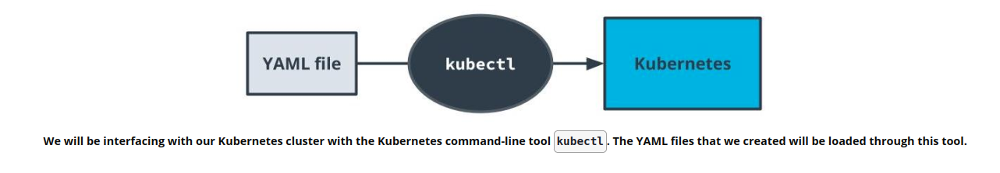

# 3-Monolith-Microservices-Scale
1. [Introduction to Microservices](#schema1)
2. [When Not to Use Microservices](#schema2)
3. [Course Outline](#schema3)
4. [AWS - Install and Configure CLI](#schema4)
5. [Monolith vs. Microservices](#schema5)
6. [Microservice Architecture Designs](#schema6)
7. [Divide Into Microservices](#schema7)
8. [Containers Using Docker](#schema8)
9. [Introducing Containers](#schema9)
10. [Docker](#schema10)
11. [Debug a Container](#schema11)
12. [Exercise: Debugging](#schema12)
13. [Container Registries](#schema13)
14. [Modifying Containers](#schema14)
15. [Automating the Application Development Lifecycle - Why Use Deployment Pipelines?](#schema15)
16. [CI/CD Benefits](#schema16)
17. [Using Travis CI](#schema17)
18. [Exercise Using Travis CI](#schema18)
19. [Environment Variables with Travis](#schema19)
20. [Orchestration With Kubernetes](#schema20)
21. [Kubernetes on AWS](#schema21)
22. [Deploy Microservices With K8s](#schema22)
23. [Solution: Kubernetes Cluster](#schema23)
24. [Alternative Deployment Strategies](#schema24)
25. [Reverse Proxy](#schema25)
26. [Exercise kubernetes for production](#schema26)

<hr>
<a name='schema1'></a>

## 1. Introduction to Microservices


**Monolitos:**

- Un monolito es una aplicación de software que se desarrolla como una única unidad o componente. Todas las funciones y características de la aplicación están empaquetadas y desplegadas juntas.
- En un monolito, todas las partes de la aplicación, como la interfaz de usuario, la lógica empresarial y la capa de datos, están interconectadas y suelen ser dependientes entre sí.
- Los monolitos son relativamente simples de desarrollar y desplegar, ya que toda la aplicación se compila y despliega como una sola entidad.
- Sin embargo, a medida que la aplicación crece en tamaño y complejidad, los monolitos pueden volverse difíciles de mantener y escalar. Además, un fallo en una parte de la aplicación puede afectar a todo el sistema.

**Microservicios:**

- Los microservicios son una arquitectura en la que una aplicación se descompone en componentes más pequeños e independientes, llamados microservicios. Cada microservicio se enfoca en una tarea específica o función de negocio.
- Los microservicios están diseñados para ser altamente cohesionados y débilmente acoplados. Esto significa que cada microservicio puede ser desarrollado, desplegado, y escalado de forma independiente sin afectar a otros componentes del sistema.
- Los microservicios se comunican entre sí a través de protocolos ligeros, como HTTP o mensajes asincrónicos. Pueden estar implementados con diferentes tecnologías y lenguajes de programación según lo que sea más adecuado para cada servicio.
- La arquitectura de microservicios facilita la escalabilidad y la flexibilidad, ya que permite a los equipos de desarrollo trabajar de forma independiente en diferentes partes de la aplicación. Sin embargo, también puede introducir complejidad en la gestión de la comunicación entre los servicios y la coordinación de las operaciones.


<hr>
<a name='schema2'></a>

## 2. When Not to Use Microservices

**Monoliths Are Not Bad!**
Microservices designs are another architectural pattern and are not intended to replace monolith applications. We should not blindly build applications as microservices without understanding the tradeoffs. Doing so could actually decrease productivity!

One way to think about this is to revisit our analogy with the Sports Superstore. Does it make sense for every aspiring small business owner to open and manage multiple stores at once?

**Considerations for Not Using Microservices**
- **System Complexity**
Rather than deploying a single application, we would be deploying multiple modules separately. There is more overhead in setting up projects.

- **Network Latency**
By introducing a network between modules, we have increased latency in application performance and will find it harder to debug our application.

- **Difficulty with Debugging**
We can no longer rely on a stack trace or tools that can help us pinpoint where a bug is. We may end up relying on logging to find causes of issues.


<hr>
<a name='schema3'></a>

## 3. Course Outline

**Microservices Design Principles and Best Practices**
- Explain different microservices architecture designs
- Divide an application into microservices

**Containers using `Docker`**
- Build and run a container image using Docker
Debug a container
- Store these images using a container registry

**Independent Releases and Deployments**
- Understand `CI/CD` benefits
- Use `Travis` to build a `CI/CD` pipeline
- Integrate `GitHub` and `CI/CD` and automate testing with CI
- Understand alternatives to `Travis` `CI` including `Jenkins`

**Service Orchestration with `Kubernetes`**
- Understand the fundamentals of `Kubernetes`

- Configure and launch an auto-scaling, self-healing `Kubernetes cluster`

- Deploy microservices using a `Kubernetes cluster`

- Understand alternative deployment strategies including `ECS` and `Fargate`

**Securing and Tuning Kubernetes Services for Production**
- Use a reverse proxy to direct requests to the appropriate backend
- Securing the microservices
- Configure scaling and self-healing for each service
- Understand the differences between internal and external traffic

**Debugging, Monitoring, and Logging** 
- Use best practices for logging with microservices
- Use logs to capture metrics for debugging
-  Implement monitoring and logging for microservices deployment
- Improve resilience and availability into cloud applications

<hr>
<a name='schema4'></a>


## 4. AWS - Install and Configure CLI

https://github.com/Cloud-developer-aws/2-Full-Stack-Apps-on-AWS


<hr>
<a name='schema5'></a>

## 5. Monolith vs. Microservices

- Microservices are an architectural style where an application is composed of modules that can be independently developed and deployed.
- In monoliths, all the components of the application are built into a single application.

**Microservice Benefits**
- Scale Lean applications that are able to tailor their logic and infrastructure to their specific business needs. More-easily architected for horizontally scaling.
- Development in Parallel Teams can develop and deploy their own codebases.
- Cost-Effectiveness Utilize resources only for what is necessary for the specific microservice.
- Flexibility Choose technologies that make the most sense for the team and business.


<hr>
<a name='schema6'></a>

## 6. Microservice Architecture Designs

**Properties of Microservices**

- **Communication**
  - Services communicate through a network
  - REST is currently the most-commonly used network interface

- **Independently Deployed**
  - Deployment to one service should not affect another

- **Fault tolerant**
  - Diligence in writing code that can anticipate when another microservice isn’t working


<hr>
<a name='schema7'></a>

## 7. Divide Into Microservices

Divide a Monolith Application Into Microservices

**Map Your Dependencies**
- It's important to understand the application you're working with before breaking it apart.
- One strategy is to map out the modules and their dependencies as a directed graph to understand the downstream impact of your changes.


**Where to Start?**
- There’s no hard rule: choose the part of the application that makes the most sense to you.
- Dependency graph serves merely as a guideline on risk based on the number of dependencies.
- A module with the least dependencies will potentially have the downstream effects meaning less risk.


**How to Start?**
- The Strangler pattern is a common and effective way to migrate legacy applications.
- Rather than replacing your code with a new version, you can gradually replace components of your application.

**Shared Code**
- Code duplication can be abstracted into common libraries used across projects.


<hr>
<a name='schema8'></a>

## 8. Containers Using Docker

**Why Use Containers?**

**Your Code is Not a Black Box...Yet**
- Applications often require many packages and dependencies to run properly
- It’s common for an application to work on one computer but not another

**Deployment Headaches**
- Organizations often have different development environments. These often include development and production.
- Deploying and testing the same code across different environments can be cumbersome
- In practice, it’s difficult to keep a development and production environment perfectly synchronized with regards to their versions, operating systems, dependencies, etc.
- It is common for code to work in a development environment and not behave as expected in production


<hr>
<a name='schema9'></a>

## 9. Introducing Containers

**Your Code is Now Kind of a Black Box**
- Containers are self-contained applications with all the dependencies needed to run
- Containers can be treated as one unit of deployment
- Rolling back code with containers is simply re-deploying an older snapshot


**Why Kind of?**
- Containers make things easier but don’t magically make deployment problems disappear
- Code may still work in one environment and fail in another, though now we have an understanding of what might have failed

**Containers are Ephemeral**
- Containers should be stateless and are expected to be destroyed.

**Containers Help Manage Dependencies**
- Each container can be running its own versioned software. We resolve the issue where different applications may have different dependencies.


**Simplify Deployment**
- Containers are self-contained so deployment is simply swapping out an existing container with a new one.


<hr>
<a name='schema10'></a>

## 10. Docker

**Docker Image**

When we have an application that we want to deploy, we can package it into a Docker Image. The image contains all of your code and dependencies.

**Docker Container**

A Docker Container is an ephemeral running instance of a Docker Image.

**Dockerfile**

A Dockerfile defines the steps to create a Docker Image.


**Basic Commands:**

`docker build -t {name_image} .  `  will run the Dockerfile to create an image

`docker images` will print all the available images

`docker run {IMAGE_ID}` will run a container with the image

`docker ps` will print all the running containers

`docker kill {CONTAINER_ID}` will terminate the container


<hr>
<a name='schema11'></a>

## 11. Debug a Container

- Viewing Logs
  - `docker logs {CONTAINER ID}`
- Attaching to a Container
  - `docker exec -it sh`
- View Docker Processes
  - `docker ps`
- View Details of Docker Objects
  - `docker inspect`

https://docs.docker.com/engine/reference/commandline/container_logs/


**Why might a container work in a local environment but not in a deployed environment?**
- Docker is programming language agnostic so it doesn't matter which programming language you use
- Security restrictions can cause problems because we often have to interface with other resources and the permission we use locally, may be different than in the deployed environment
- System resouces are also important to ensure we have all of the resources that an application needs to run
- Credentials can also be problematic as you deploy code from a local environment to a deployed environment


<hr>
<a name='schema12'></a>

## 12. Exercise: Debugging

Folder debugging-exercise


- Build the Docker image:
``` bash
docker build -t debug_me .
```
- Check that the image has been build and access its IMAGE ID
```bash
docker images
```
- Run Docker container
```bash
docker run -d {IMAGE ID}
```
Using the -d flag runs the image in a container as a background task so the container we can continue to run other commands in our terminal.

- View Docker Processes
```bash
  docker ps
```
- View Details of Docker Objects
```bash
docker inspect {CONTAINER ID}
```

- Viewing Logs
``` bash
docker logs {CONTAINER ID}
```


- Inspect the code in `server.js` and see that there is a typo -- should be getDate instead of getData

- Fix the error, rebuild the Docker image and re-run it to confirm that the error has resolved.
```bash

docker build -t debug_me .  
```
```bash
docker images 
```
```bash
docker run -d  ID_image
```
```bash
docker logs container_id
```
- Stop all containers
```bash
docker stop $(docker ps -q)

```
- Delete all containers
```bash
docker rm $(docker ps -aq)

```

- Delete image
```bash
docker rmi  ID_image
```


<hr>
<a name='schema13'></a>


## 13. Container Registries

**Container Registries**
- A container registry serves as a centralized place to store and version images.
- [DockerHub](https://hub.docker.com/) is a popular container registry run by the same organization that created Docker.

**Creating and Using a DockerHub Repository**
1. In DockerHub, create a new repository and set it to Public

2. In your terminal, login to DockerHub

```bash
docker login --username={YOUR USERNAME}
```

3. Tag your local image with the repository name:
```bash
docker tag {LOCAL IMAGE NAME} {USERNAME}/{REPOSITORY NAME}
```
4. Push the image to DockerHub
```bash
docker push {TAGGED IMAGE}
```


**Base Images**
- Bundles the steps that are repeated in multiple builds into a pre-built package
- Base images reduce time that it takes to run redundant operations
- Uses the FROM keyword in Dockerfile, e.g. FROM node:13


<hr>
<a name='schema14'></a>

## 14. Modifying Containers

**Best Practices for Modifying Containers**
- Docker images should be considered a single unit of deployment.
- You shouldn't be editing code or making changes to the system at all in a container.
- If something is broken, you build a new image and deploy that to a new container.

```bash
docker exec -it {Id_container} sh

```
Se utiliza para iniciar una sesión interactiva dentro de un contenedor Docker en ejecución y ejecutar el shell Bash (sh) dentro de ese contenedor. Esto es útil para realizar tareas de mantenimiento, depuración o exploración dentro del entorno del contenedor.
Se pue usar por ejemplo `ls` para ver el listado de archivos de la carpeta

- Modified error
```bash
vim server.js 
```
- Rebuilt image
```bash

docker build -t debug_me .  
```


<hr>
<a name='schema15'></a>


## 15. Automating the Application Development Lifecycle - Why Use Deployment Pipelines?

### **Understanding Deployment Pipelines**
- We now have industry standards and tools for how we can deploy our code.
- Docker containers simplify what we deploy.
- Deployment pipelines simplify how we deploy Docker containers.
- Code is often deployed multiple times to different environments to validate functionality and minimize bugs.
- Deployment pipelines enable us to have an automated process that is reliable and reproducible.


### **Deploying Code**

Code After Coding
Once your code is done, how do you ship it? Typically, the software development cycle will proceed with building the code, installing all of the dependencies, running automated tests, manually testing, and then repeating for each development environment the application needs to be deployed to.

- It’s a common fallacy to underestimate the time it takes to deploy code
- Teams deploying enterprise software often involves many internal and external dependencies that may include: infrastructure changes, security changes, permissions provisioning, load testing


<hr>
<a name='schema16'></a>

## 16. CI/CD Benefits

**Continuous Integration**
Process in which code is tested, built into a Docker image, and deployed to a container registry.

**Continuous Deployment**
Process in which our Docker image is deployed to containers.

**Additional Benefits**
By streamlining our build and deploy to an automated process, developers are provided the least privilege that they need to write their code.


CI/CD, que significa Integración Continua/Entrega Continua (Continuous Integration/Continuous Delivery), es una práctica de desarrollo de software que tiene como objetivo automatizar y mejorar el proceso de entrega de aplicaciones de software de manera rápida, frecuente y confiable.

Aquí hay una breve explicación de cada parte:

**Integración Continua (CI):** Es el proceso de integrar y validar el código nuevo o actualizado en un repositorio compartido de manera frecuente y automática. Esto implica la ejecución de pruebas automatizadas y la verificación de la calidad del código cada vez que se realizan cambios en el repositorio. La integración continua permite detectar y solucionar problemas de forma temprana en el ciclo de desarrollo, lo que ayuda a mantener una base de código estable y listo para la implementación.

**Entrega Continua (CD):** Es el proceso de automatizar la entrega del software a un entorno de producción o de pruebas de manera consistente y confiable. Esto implica la automatización de la compilación, prueba, empaquetado y despliegue del software en un entorno controlado. La entrega continua permite a los equipos de desarrollo entregar cambios de manera rápida y segura a los usuarios finales, reduciendo el tiempo y el riesgo asociado con las implementaciones manuales.


### **Why do non-technical individuals at a business care about using CI/CD?**
- CI/CD allows for a tight feedback loop
- Bugs are inevitable -- CI/CD helps us identify them in a deployed environment
- CI/CD makes the pipeline more available


<hr>
<a name='schema17'></a>

## 17. Using Travis CI

**Using Travis for Continuous Integration**
- Travis is a tool that helps us with the CI process
- Travis integrates with your application using a YAML file
- YAML files are often used to specify configurations.
- Travis can be used to build and push images to DockerHub

**YAML**
YAML is similar to how JSON is also used as a representation of data but YAML is considered more readable.

- YAML is generally suited for configuration files
- YAML is generally suited for expressing data.

When used as configurations, they are often interchangeable. The examples below show how a YAML file can be represented as JSON.

**Travis File**
The Travis file is always named `.travis.yml` and stored in the top-level of your git directory. This is detected by Travis CI and turned into a build pipeline.


<hr>
<a name='schema18'></a>

## 18. Exercise Using Travis CI


[Exercise  Travis](https://github.com/patri-carrasco/travis_ci)

<hr>
<a name='schema19'></a>


## 19. Environment Variables with Travis
**Environment Variables**

Environment variables are a useful way to handle variables that shouldn’t be hard-coded into our application. These values are often credentials that shouldn’t be stored in the code.

**Environment Variables with Travis**

Travis provides a way to set environment variables without having them exposed. These values will be used during the Travis build process.

- In your TravisCI dashboard, navigate to a repository
- Navigate to the Settings screen
- Set values in Environment Variables


<hr>
<a name='schema20'></a>

## 20. Orchestration With Kubernetes

### **Orchestration is the automated management of the lifecycle of our application**

- With CI/CD, if Travis is our CI tool, then Kubernetes is our CD tool
- Orchestration helps us handle complicated workflows in deploying our application
- Helps us automate our deployment process for continuous deployment


### **Fundamentals of Kubernetes**

#### **Key Points**
- Kubernetes
  - A container orchestration system packed with features for automating our application’s deployment
  - Enables us to easily scale our application and ship new code
- Pods
  - Containers often need to communicate with one another. It's not uncommon to see a deployment involving a few containers to be deployed.
  - Kubernetes pods are abstractions of multiple containers and are also ephemeral.
- Services
  - Applications are often deployed with multiple replicas. This helps with load balancing and horizontal scaling.

  - Services are an abstraction of a set of pods to expose them through a network.


<hr>
<a name='schema21'></a>


## 21. Kubernetes on AWS

### **Key Points**
- AWS EKS is a service that we can use to set up Kubernetes.

- The `deployment.yaml` file is used to specify how our pods should be created.

- The `service.yaml` file is used to specify how our pods are exposed.

**deployment.yaml** 
```
yaml apiVersion: apps/v1 kind: Deployment metadata: name: my-app labels: app: my-app spec: replicas: 2 selector: matchLabels: app: my-app template: metadata: labels: app: my-app spec: containers: - name: simple-node image: YOUR_DOCKER_HUB/simple-node ports: - containerPort: 80
```

**service.yaml**
```
yaml apiVersion: v1 kind: Service metadata: name: my-app labels: run: my-app spec: ports: - port: 80 protocol: TCP selector: run: my-app
```

1. Create a Kubernetes Cluster on AWS

2. Create a Node Group in AWS

In Amazon EKS (Elastic Kubernetes Service), a "node group" is a set of EC2 instances (virtual machines) used to run your containerized applications and workloads in a Kubernetes cluster. When you create an EKS cluster in AWS, it's common for at least one node group to be automatically created so that you have nodes available to run your Kubernetes pods.


### **Creating a Kubernetes Cluster on AWS**

- **Step 1:** Create IAM Roles for the EKS Cluster and Node Group
  - Create EKS Cluster IAM role:
    1. Navigate to the Roles tab in the Identity and Access Management (IAM) dashboard in the AWS Console
    2. Click Create role
    3. Select type of trusted entity:
        - Choose EKS as the use case
        - Select EKS-Cluster
        - Click Next: Permissions
    4. Click Next: Tags
    5. Click Next: Review
        - Give the role a name, e.g. EKSClusterRole
    6. Click Create role.

You should see a message saying The role AWSServiceRoleForAmazonEKS has been created.

  - Create EKS Cluster Node Group:
    1. In the IAM Roles tab, click Create role
    2.  Select type of trusted entity:
        - Choose EC2 as the use case
        - Select EC2
        - Click Next: Permissions
    3.  In Attach permissions policies, search for each of the following and check the box to the left of the policy to attach it to the role:
        - AWS AmazonEC2ContainerRegistryReadOnly
        - AmazonEKSWorkerNodePolicy
        - AmazonEKS_CNI_Policy
    4. Click Next: Tags
    5. Click Next: Review
        - Give the role a name, e.g. NodeRole
    6. Click Create role.

You should see a message saying The role AWSServiceRoleForAmazonEKSNodegroup has been created.

  - **Step 2:** Create an SSH Pair
    1. Navigate to the Key pairs tab in the EC2 Dashboard
    2. Click Create key pair
        - Give the key pair a name, e.g. mykeypair
        - Select RSA and .pem
    3. Click Create key pair.


  - **Step 3:** Create an EKS Cluster
    1. Navigate to the Clusters tab in Amazon EKS dashboard in the AWS Console
    2. Click Create cluster
    3. Specify:
        - a unique Name (e.g. MyEKSCluster)
        - Kubernetes Version (e.g. 1.21)
        - Cluster Service Role (select the role you created above, e.g.EKSClusterRole)
    4. Click Next
    5. In Specify networking look for Cluster endpoint access, click the Public radio button
    6. Click Next and Next
    7. In Review and create, click Create

It may take 5-15 minutes for the EKS cluster to be created.

  - **Step 4:** Create a Node Group
    1. Click on the Compute tab in the newly-created cluster
    2. Click Add Node Group
    3. Specify:
        - a unique Name (e.g. MyNodeGroup)
        - Cluster Service Role (select the role you created above, e.g.NodeRole)
    4. Create and specify SSH key for node group
    5. In Node Group compute configuration, set instance type to 8t3.micro and disk size to 4* to minimize costs
    6. In Node Group scaling configuration, set the number of nodes to 2
    7. Click Next
    8. In Node Group network configuration, toggle on Configure SSH access to nodes
        - Select the EC2 pair created above (e.g. mykeypair)
        - Select All
        - Click Next
    9. Review the configuration and click "Create"


  - **Step 5:** Delete Running Services
  
  <span style="color:red">IMPORTANT! Don't forget to delete services when you no longer need them.</span>


These services will need to be deleted in order. Each step can take several minutes.

1. Delete the Node Group
2. Delete the EKS Cluster


**Deployment YAML**
```
apiVersion: apps/v1
kind: Deployment
metadata:
  name: my-app
  labels:
    app: my-app
spec:
  replicas: 2
  selector:
    matchLabels:
      app: my-app
  template:
    metadata:
      labels:
        app: my-app
    spec:
      containers:
      - name: simple-api
        image: <ECR_REPOSITORY>
        ports:
        - containerPort: 80
```

**Service YAML**
```
apiVersion: v1
kind: Service
metadata:
  name: my-app
  labels:
    run: my-app
spec:
  ports:
  - port: 80
    protocol: TCP
  selector:
    run: my-app

```

<hr>
<a name='schema22'></a>

## 22. Deploy Microservices With K8s

At this point, we have a Kubernetes cluster set up and understand how YAML files can be created to handle the deployment of pods and expose them to consumers. Moving forward, we’ll be using the Kubernetes command-line tool, kubectl, to interact with our cluster.

**Interacting With Your Cluster**
1. [Install `kubectl`](https://docs.aws.amazon.com/eks/latest/userguide/install-kubectl.html)
  ```bash
  curl -O https://s3.us-west-2.amazonaws.com/amazon-eks/1.29.0/2024-01-04/bin/linux/amd64/kubectl
  ```
  ```bash
  chmod +x ./kubectl
  ```
  ```bash
  mkdir -p $HOME/bin && cp ./kubectl $HOME/bin/kubectl && export PATH=$HOME/bin:$PATH

  ```
2. [Set up `aws-iam-authenticator`](https://docs.aws.amazon.com/eks/latest/userguide/what-is-eks.html)
3. [Set up `kubeconfig`](https://docs.aws.amazon.com/eks/latest/userguide/create-kubeconfig.html)


**update the Kubernetes configuration (kubeconfig)**

```bash
aws eks --region us-east-1 update-kubeconfig --name PatriEKSCluster
```
is used to update the Kubernetes configuration (kubeconfig) on your local machine to connect to an Amazon EKS (Elastic Kubernetes Service) cluster.


<span style="color:red">IMPORTANT! Your local settings should be the same as your online settings.</span>

[Configure the AWS CLI](https://github.com/Cloud-developer-aws/2-Full-Stack-Apps-on-AWS?tab=readme-ov-file#schema3)


**Loading YAML files**

- `kubectl apply -` create deployment and service
```bash
kubectl apply -f deployment.yaml
```

**Introductory Commands**

`kubectl` provides a wide range of commands to interact with Kubernetes. The following are some basic commands that we can use to interact with our current cluster.

- `kubectl get pods` - show the pods in the cluster
- `kubectl describe services` - show the services in the cluster
- `kubectl cluster-info` - display information about the cluster




<hr>
<a name='schema23'></a>

## 23. Solution: Kubernetes Cluster


- Step 1: Deploy resources
Send YAML files to Kubernetes to create resources. This will create the number of requested of the specified image:
```bash
kubectl apply -f deployment.yaml
```
and create the service:
```bash
kubectl apply -f service.yaml
```
- Step 2: Confirm deployment
Verify that the resources have been created:
```bash
kubectl get pods
```
<span style="color:red">If the status remains <strong>pending,</strong> it is advisable to change the number of nodes in the node group.<span>


and check to see that they were created correctly:
```bash
kubectl describe services
```
To get more metadata about the cluster, run:
```bash
kubectl cluster info dump
```


<hr>
<a name='schema24'></a>

## 24. Alternative Deployment Strategies

Kubernetes is one solution for deploying your containers. It's packed with features but can sometimes be overwhelming. As we've mentioned before, choosing a tool comes with its own set of tradeoffs. Here are a few other popular technologies that are used in the industry today.

- AWS ECS - AWS proprietary solution that predates AWS EKS. It integrates very well with other AWS tools and is a bit more straightforward as it is not as feature-packed as Kubernetes.
- AWS Fargate - AWS tool that helps streamline deploying containers to ECS and EKS.
- Docker - An option to simply run the container manually with Docker. Sometimes, it's tempting to pick a shiny hot tool that may lead to over-engineered architectures.

<hr>
<a name='schema25'></a>

## 25. Reverse Proxy


Un reverse proxy es un tipo de servidor proxy que toma las solicitudes de los clientes y las reenvía a uno o más servidores backend. A diferencia de un proxy tradicional que actúa como intermediario entre el cliente y el servidor, un reverse proxy se encuentra entre el cliente y uno o más servidores, actuando como intermediario para los servidores.

El término "reverse" se refiere a la inversión del flujo normal de tráfico de red. En lugar de que el cliente se conecte directamente al servidor, el cliente se conecta al reverse proxy y luego el reverse proxy enruta la solicitud al servidor correspondiente, luego recibe la respuesta del servidor y la reenvía al cliente.

Los reverse proxies se utilizan comúnmente para diversos propósitos, como:

- Balanceo de carga: Distribuir las solicitudes entrantes entre varios servidores backend para mejorar el rendimiento y la disponibilidad del servicio.

- Caché: Almacenar en caché contenido estático para servirlo rápidamente a los clientes y reducir la carga en los servidores backend.

- Seguridad: Actuar como un punto de entrada seguro al entorno de backend, ocultando la estructura interna de la red y protegiendo los servidores backend de ataques directos.

- Gestión de tráfico: Permitir la configuración de políticas de enrutamiento avanzadas, como redireccionamiento de URL, reescritura de encabezados y filtrado de solicitudes.


**Reverse Proxy**
- A single interface that forwards requests on behalf of the client and appears to the client as the origin of the responses.
- Useful for abstracting multiple microservices to appear as a single resource.

**API Gateway**
- A form of a reverse proxy that serves as an abstraction of the interface to other services.


**Sample Reverse Proxy**
- Nginx is a web server that can be used as a reverse proxy. Configurations can be specified with an `nginx.conf` file.

- Sample bare-bones `nginx.conf` file:

```
events {
}
http {
    server {
        listen <PORT_NUMBER>;
        location /<PROXY_PATH>/ {
            proxy_pass http://<REDIRECT_PATH>/;
        }
    }
}
```

**Accessing an Endpoint in a Kubernetes Pod (The hard way!)**

Let's look at the state of the Kubernetes pods and the services we can use to access them.

First, let's look at the pods to see what is running:

```bash
kubectl get pods
```
and then look at services to find the entry point for accessing the pod:
```bash
kubectl describe services
```

In the output we can find this service Name: `my-app-2-svc` and see `Type: ClusterIP` which means that the service is only accessible within the cluster.

We can connect to the pod using the `exec` command that we used earlier:
```bash
kubectl exec -it {POD NAME} -- bash
```
and use curl to access the endpoint:
```bash
curl http://my-app-2-svc:8080/health
```
and we get the `Hello!` response returned.


**Accessing an Endpoint in a Kubernetes Pod using Reverse Proxy**

The `Dockerfile` is pretty straightforward:
- Base image from `nginx/alpinewhich` is useful for routing web requests
- Service uses `nginx.conf`
Dockerfile 

```yaml
FROM nginx:alpine
COPY nginx.conf /etc/nginx/nginx.conf
```
The `nginx.conf` sets up the service to listen for the requests that come in to port 8080 and forward any requests to API endpoint to the `http://my-app-2-svc` endpoint in the app.

`nginx.conf`
```yaml
events { } http { server { listen 8080; location /api/ { proxy_pass http://my-app-2-svc:8080/; } } }
```
The `deployment.yaml` file is also very similar to what you've seen so far:

- Creates a single pod
- Named reverseproxy
- Configurations to limit resources

`reverseproxy_deployment.yaml` 

```yaml
apiVersion: extensions/v1beta1
kind: Deployment
metadata:
  labels:
    service: reverseproxy
  name: reverseproxy
spec:
  replicas: 1
  template:
    metadata:
      labels:
        service: reverseproxy
    spec:
      containers:
      - image: {Docker_Id}/simple-reverse-proxy
        name: reverseproxy
        imagePullPolicy: Always
        resources:
          requests:
            memory: "64Mi"
            cpu: "250m"
          limits:
            memory: "1024Mi"
            cpu: "500m"
        ports:
        - containerPort: 8080
      restartPolicy: Always


```

The `service.yaml` file is also straightforward.

- The service is named `reverseproxy-svc`
- Bound to port `8080`
- Connects to the pods named `reverseproxy`

`reverseproxy_service.yaml`

```yaml
apiVersion: v1
kind: Service
metadata:
  labels:
    service: reverseproxy
  name: reverseproxy-svc
spec:
  ports:
  - name: "8080"
    port: 8080
    targetPort: 8080
  selector:
    service: reverseproxy

```


**We're Ready to Deploy our Reverse Proxy!**

The commands that we use to deploy the reverse proxy are the same as that used to deploy the application. kubectl is used as our tool to interface with our cluster and the YAML file specifies the configuration for our reverse proxy.
```bash
kubectl apply -f reverseproxy_deployment.yaml
```
```bash
kubectl apply -f reverseproxy_service.yaml
```

Now we have a reverse proxy setup, and we can extend the nginx.config file to connect to multiple pods and use the reverse proxy service act as a gateway for multiple pods.

<hr>
<a name='schema26'></a>

## 26.Exercise kubernetes for production

1.-  Add Dockerfile
```yaml
# Use NodeJS base image
FROM node:13

# Create app directory
WORKDIR /usr/src/app

# Install app dependencies by copying
# package.json and package-lock.json
COPY package*.json ./

# Install dependencies
RUN npm install

# Copy app source
COPY . .

# Bind the port that the image will run on
EXPOSE 8080

# Define the Docker image's behavior at runtime
CMD ["node", "server.js"]

```

2.- [Create `deployment.yaml`](./kubernetes-for-production/deploy/deployment.yaml)

3.- [Create `service.yaml`](./kubernetes-for-production/deploy/service.yaml)

4.- Create DockerImage `simple-express`

5.- Deploy
```bash
kubectl apply -f deploy/deployment.yaml
```
```bash
kubectl apply -f deploy/service.yaml
```
6.- Confirm deployment Verify that the resources have been created

```bash
kubectl get pods
```
```bash
kubectl describe services
```

7.- We can connect to the pod using the `exec` command that we used earlier:
```bash
kubectl exec -it {POD NAME} -- bash
```
and use curl to access the endpoint:
```bash
curl http://my-app-2-svc:8080/health
```


8.- Create `nginx.conf`
```yaml
events { } http { server { listen 8080; location /api/ { proxy_pass http://my-app-2-svc:8080/; } } }
```
9.- Modified `Dockerfile`
```docker
FROM nginx:alpine

COPY nginx.conf /etc/nginx/nginx.conf
```

10.-  Create `reverseproxy_deployment.yaml`
```yaml
apiVersion: apps/v1
kind: Deployment
metadata:
  labels:
    service: reverseproxy
  name: reverseproxy
spec:
  replicas: 1
  selector:
    matchLabels:
      service: reverseproxy
  template:
    metadata:
      labels:
        service: reverseproxy
    spec:
      containers:
      - image: patricarrasco/simple-express
        name: reverseproxy
        imagePullPolicy: Always
        resources:
          requests:
            memory: "64Mi"
            cpu: "250m"
          limits:
            memory: "1024Mi"
            cpu: "500m"
        ports:
        - containerPort: 8080


```
11.- Create `reverseproxy_service.yaml`
```yaml
apiVersion: v1
kind: Service
metadata:
  labels:
    service: reverseproxy
  name: reverseproxy-svc
spec:
  ports:
  - name: "8080"
    port: 8080
    targetPort: 8080
  selector:
    service: reverseproxy

```
12.- Rebuild Docker images
```bash
docker build -t simple-express .

docker tag simple-express patricarrasco/simple-express

docker push patricarrasco/simple-express
```


13.- Deploy
```bash
kubectl apply -f reverseproxy_deployment.yaml
```
```bash
kubectl apply -f reverseproxy_service.yaml
```

14.- Connect to the pod

```bash
kubectl exec -it {POD NAME} -- sh
```
and use curl to access the endpoint:
```bash
curl http://my-app-2-svc:8080/health

```


